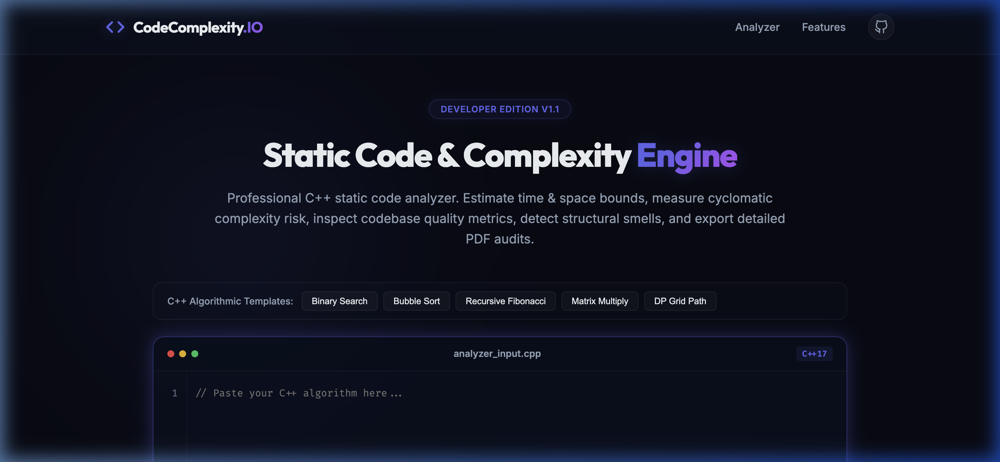
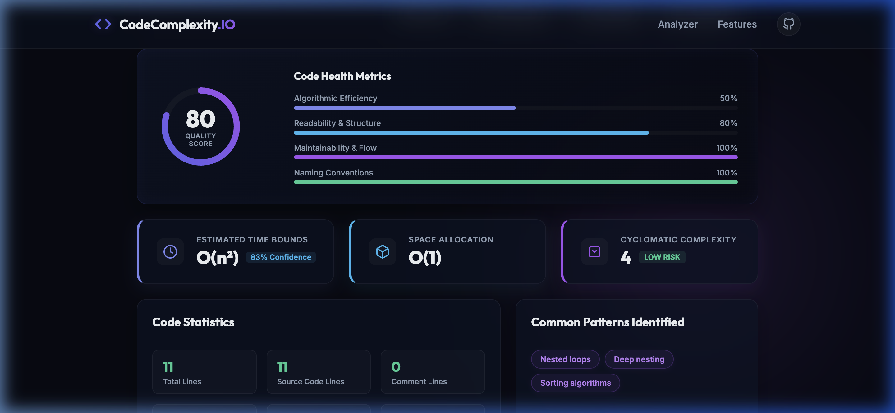
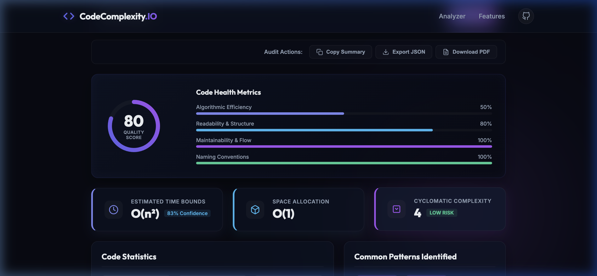
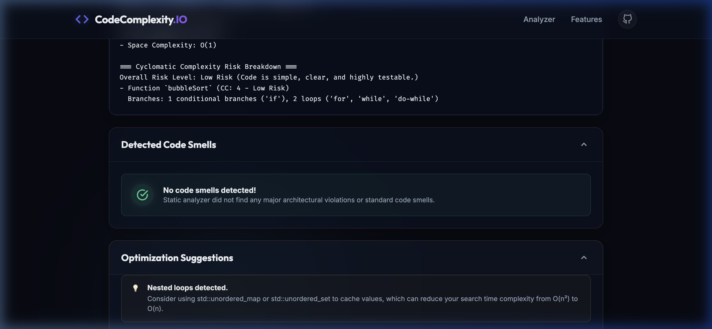
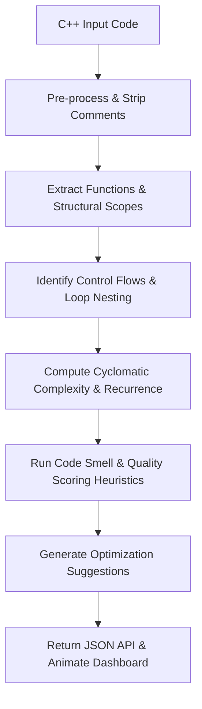

# Code Complexity Analyzer

[](https://github.com/muskanlohani25/code-complexity-analyzer/actions)


[](LICENSE)


[](https://render.com/deploy?repo=https://github.com/muskanlohani25/code-complexity-analyzer)

An advanced, developer-grade static analysis tool designed to audit C++ source code structures without compilation. Automatically estimates time and space complexities, computes McCabe's Cyclomatic Complexity, grades codebase metrics (Quality Score), scans for common code smells, and outputs download-ready JSON/PDF reports.

---

## 🎨 Hero Banner


---

## 🔍 Overview

Static complexity auditing is crucial for writing performant, readable, and maintainable software. However, compiling code to profile it is often slow or impossible in isolated modules.

**Code Complexity Analyzer** is built to bridge this gap. By evaluating code structure, loop hierarchies, branching conditions, and variable lifetimes, it determines:
* **What the project does**: Scans C++ snippets statically to produce complexity estimations, stats, code smells, and quality metrics.
* **Why it exists**: To give developers immediate visual feedback on algorithm efficiency before merging, avoiding expensive runtime regressions.
* **Who it is for**: Software Engineers, Open Source Contributors, and Educators looking to test algorithms or check student code structures.

---

## 🚀 Features

* **⚡ Time Complexity Analysis**: Evaluates nested loop depths, logarithmic division patterns, and recursive branches ($O(1)$, $O(\log n)$, $O(n)$, $O(n \log n)$, $O(n^2)$, $O(n^3)$, $O(2^n)$, $O(\infty)$).
* **💾 Space Complexity Analysis**: Scans local collections, STL allocations (`std::vector`, `std::map`, etc.), and recursion call stacks to estimate auxiliary memory overhead.
* **🔄 Cyclomatic Complexity (CC)**: Computes function branch nodes using McCabe's metrics, reporting CC scores and risk thresholds (Low, Moderate, High, Extreme).
* **📈 Code Quality Score**: Provides a weighted 0-100 overall grade, broken down across **Efficiency**, **Readability**, **Maintainability**, and **Naming** indicators.
* **🔍 Code Smell Detection**: Automatically identifies common C++ code smells like:
  - Magic Numbers (hardcoded literals)
  - Long Functions (>40 lines)
  - Deep Nesting (depth >= 4)
  - Large Parameter Lists (>=4 parameters)
  - Mutable Global Scope variables
  - Duplicate sequential loops
* **💡 Optimization Suggestions**: Generates concrete solutions (e.g. passing objects by `const reference`, converting linear recursion to iterative steps, or swapping `std::map` with `std::unordered_map`).
* **🎯 Confidence Scores**: Estimates parser certainty percentages based on static indicators.
* **📄 Report Exports**: Allows instant downloads of raw JSON structures or print-ready PDF audits.
* **📱 Responsive Dashboard**: High-fidelity dark mode dashboard with synchronized line numbers and collapsible results cards.

---

## 📸 Screenshots

| Landing Page & Editor | Analysis Dashboard |
| --- | --- |
|  |  |

| Quality Metrics | Code Smells & Suggestions |
| --- | --- |
|  |  |

---

## ⚙️ Architecture

The project has a modular, clean structure designed to be easily extensible for new compiler frontends or languages.

```text
code-complexity-analyzer/
├── app.py                     # Flask application factory / Entrypoint
├── routes.py                  # API endpoints and blueprint routes
├── analyzer.py                # Core static complexity calculator engine
├── helpers.py                 # C++ bracket locator & comment stripper
├── run_qa_audit.py            # Automated QA suite with 50 test cases
├── test_analyzer.py           # Standard production unit tests
├── requirements.txt           # Python package dependencies
├── LICENSE                    # MIT license details
├── static/
│   ├── css/
│   │   └── styles.css         # Modern glassmorphic dark theme stylesheet
│   └── js/
│   │   └── main.js            # Frontend interactions, SVG animations, PDF downloads
│   └── images/
└── templates/
    └── index.html             # Main dashboard template layout
```

### Module Descriptions
- **`analyzer.py`**: The brain of the application. Processes token streams inside function scopes, estimates loops complexity, checks call-graphs, and runs quality/smell score heuristics.
- **`helpers.py`**: A utility preprocessor that strips block and line comments while maintaining absolute indices. It also contains robust string search scope limiters for brace matching.
- **`routes.py`**: Manages HTTP blueprints, request decoding, and error wrapping.

---

## 🔄 Static Analysis Pipeline

The parser operates as a sequential pipeline to process, compute, and return C++ metrics:



---

## 🛠️ Technologies Used

### Frontend
- **HTML5 & Vanilla CSS3**: Custom grid configurations, CSS custom properties, scroll-driven animations, and glassmorphic card patterns.
- **JavaScript (ES6)**: Circular progress SVG dash offset calculations, event-driven transitions, and clipboard handlers.
- **html2pdf.js**: Client-side library compiling responsive widgets into structured print-ready PDFs.

### Backend
- **Python 3.10+**: Core analysis math and token heuristics.
- **Flask (WSGI)**: Lightweight routing and API dispatch.

### Testing
- **Unittest**: Core regression testing.
- **Custom QA Audit Runner**: Execution suite running validation metrics on 50 algorithm categories.

---

## 📦 Installation

Ensure you have Python 3.10+ installed.

1. **Clone the repository**:
   ```bash
   git clone https://github.com/yourusername/code-complexity-analyzer.git
   cd code-complexity-analyzer
   ```

2. **Create and activate a virtual environment**:
   ```bash
   python3 -m venv venv
   source venv/bin/activate  # On Windows use `venv\Scripts\activate`
   ```

3. **Install dependencies**:
   ```bash
   pip install -r requirements.txt
   ```

---

## 🏃 Running Locally

To run the application locally using Gunicorn (production parity):
```bash
gunicorn wsgi:app --config gunicorn.conf.py
```
Or for local hot-reload development:
```bash
python3 app.py
```

---

## 🚀 Cloud Deployment

This project is configured out-of-the-box for seamless deployments on **Render** and **Railway**.

### 1. Render Deployment
1. Connect your GitHub repository to [Render](https://render.com/).
2. Select **New Web Service**.
3. Configure the following properties:
   - **Runtime**: `Python 3`
   - **Build Command**: `pip install -r requirements.txt`
   - **Start Command**: `gunicorn wsgi:app --config gunicorn.conf.py`
4. Add environment variables if needed under the **Environment** tab.

### 2. Railway Deployment
1. Connect your repository to [Railway](https://railway.app/).
2. Click **New Project** -> **Deploy from GitHub repo**.
3. Railway automatically detects the `Procfile` and uses `wsgi.py` for deployment.
4. Port bindings will automatically map using Gunicorn's configuration.

Once the server is running locally, access the dashboard at:
👉 **[http://127.0.0.1:5001](http://127.0.0.1:5001)**

---

## 📝 Sample Input

```cpp
// Bubble sort implementation
void bubbleSort(vector<int>& arr) {
    int n = arr.size();
    for (int i = 0; i < n - 1; i++) {
        for (int j = 0; j < n - i - 1; j++) {
            if (arr[j] > arr[j + 1]) {
                swap(arr[j], arr[j + 1]);
            }
        }
    }
}
```

---

## 📊 Sample Output (JSON API)

```json
{
  "time_complexity": "O(n²)",
  "space_complexity": "O(1)",
  "cyclomatic_complexity": {
    "overall_value": 4,
    "risk_level": "Low Risk",
    "details": [
      {
        "name": "bubbleSort",
        "complexity": 4,
        "risk": "Low Risk",
        "breakdown": [
          "2 loops ('for', 'while', 'do-while')",
          "1 conditional branches ('if')"
        ]
      }
    ],
    "explanation": "Code is simple, clear, and highly testable."
  },
  "quality_scores": {
    "overall": 80,
    "efficiency": 50,
    "readability": 90,
    "maintainability": 90,
    "naming": 90
  },
  "code_smells": [],
  "confidence_score": 93,
  "stats": {
    "functions_count": 1,
    "loops_count": 2,
    "if_statements": 1,
    "lines_total": 11,
    "lines_code": 10,
    "lines_comment": 1,
    "variables_count": 2
  }
}
```

---

## 🧪 Testing

The repository runs two testing suites to guarantee parser correctness.

### Core Unit Tests
Verifies basic complexity mappings, regex filters, and preprocessor comment strippers. Run using:
```bash
python3 test_analyzer.py
```

### Complete QA Audit Suite
Executes 50 distinct test cases containing single loops, nested matrices, sorting scripts, graph algorithms (BFS, DFS, Dijkstra, Prim, Kruskal), template parameters, and preprocessor directives. Run using:
```bash
python3 run_qa_audit.py
```

---

## ⚠️ Limitations

* **Heuristics-Based**: This tool utilizes **Static Regular Expression Analysis** and scope counting. It does not construct a compiler Abstract Syntax Tree (AST).
* **No Compiler Frontend**: It evaluates complexities based on structure signatures and does not run semantic checks, type resolution, or template instantiation.
* **Heuristics Bounds**: Highly obfuscated templates or complex macro definitions might limit parsing accuracy. For full safety audit reports, cross-verify with compiler profilers.

---

## 🗺️ Future Roadmap

* 🧠 **AI Explanations**: Integrate Gemini API hooks to explain optimization recommendations.
* 🌐 **Multi-Language Support**: Extend parsers to audit Java, Python, and Rust structures.
* 🔧 **Clang AST Integration**: Incorporate standard `libclang` bindings to perform strict abstract syntax tree audits.
* ☁️ **Cloud Deployments**: Pre-configured configurations for AWS Elastic Beanstalk and Docker containers.

---

## 🤝 Contributing

Contributions make the open-source community thrive. Please review [CONTRIBUTING.md](CONTRIBUTING.md) to get started on branching and standards.

---

## 📜 License

Distributed under the MIT License. See [LICENSE](LICENSE) for more information.

---

## 💖 Acknowledgements

* [McCabe's Cyclomatic Complexity Metric](https://en.wikipedia.org/wiki/Cyclomatic_complexity)
* [html2pdf.js Library](https://github.com/eKoopmans/html2pdf.js)
* Google Fonts [Outfit](https://fonts.google.com/specimen/Outfit) and [Inter](https://fonts.google.com/specimen/Inter)
